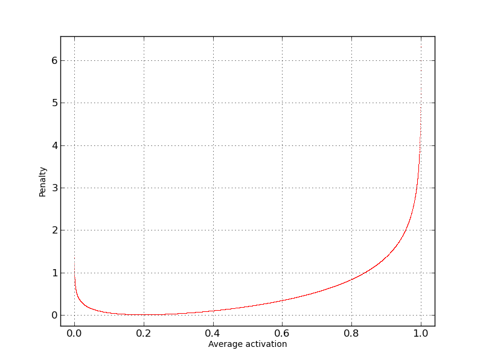

Simple AutoEncoder
==================

* `Data`_
* `Theory`_
* `How it performs`_

Here I'll describe *second step* in understanding what TNNF can do for you.
Using MNIST data - let's create simple (one layer) sparse *AutoEncoder (AE)*, train it and visualise its weights.
This will give understanding of how to compose a little bit complicate networks in TNNF (two layers) and how sparse AE works.

Data
----

To train our AE - let's use widely known MNIST data set.

You can download it in *.csv* format here: http://www.pjreddie.com/projects/mnist-in-csv

* `Train set <http://www.pjreddie.com/media/files/mnist_train.csv>`_
* `Test set <http://www.pjreddie.com/media/files/mnist_test.csv>`_

As *.csv* format is comparatively slow and increases train time significantly we recommend to
use `HDF <https://en.wikipedia.org/wiki/Hierarchical_Data_Format>`_ to store data on your drive.

It takes you to install **h5py** package to start use it. `Here <http://www.h5py.org/>`_ is more about it.

.. note::

   It's better to `download <https://pypi.python.org/pypi/h5py>`_ their package instead of trying to install through *pip*.

Once you install *h5py* you need to convert *.csv* to *HDF*. I've prepared a short script in Python for you to do this.

You can download it directly from `GitHub <https://github.com/spaceuniverse/TNNF/tree/master/doc/src/HOWTOs/Data/CSVtoHDF.py>`_.
You need to run it against both *.csv* files: **train and test** sets.

Here is what you need to change there:

.. literalinclude:: src/HOWTOs/Data/CSVtoHDF.py
   :language: python
   :start-after: import h5py
   :end-before: #Get DATA from CSV

Where:
 | **srcFolder** - directory, where csv file located
 | **csv_type** - *.csv* file extension. You don't need to change it usually.
 | **hdf_type** - HFD file extension. You don't need to change it usually.
 | **target_csv** - *.csv* file name, without extension.
 | **target_hdf** - HDF file name. File will be created and filled with data from *.csv* .

After all you will have two *.h5py* files with train and test MNIST data.

Theory
------

A little theory about sparse constraint, how it looks like.

When we introduce sparse constraint to our network, we expect
that average activation of particular neuron for one data's batch will be equal to the one, we specified.
To achieve this - we will add penalty to the network error each time our real average activation will diff from the specified.
To estimate, how big this penalty should be we use Kullback-Leibler equation. Here how it looks like:

.. math::

   penalty=\sum\limits_{j=1}^{hiddenUnits}\rho\log\frac{\rho}{\hat\rho_{j}}+(1-\rho)\log\frac{1-\rho}{1-\hat\rho_{j}}

To be more human oriented, let's visualise its graph.

On the following graph we assume we want our *average activation = 0.2* .
Then, given variety of *average activation* on *X-axis* we can observe penalty value on *Y-axis*.

As you can see - **Penalty** is very close to zero only when our **Average activation** is close to the *0.2* and
vice-versa - the more **average activation** gets away from desired *0.2*, the bigger **Penalty** becomes.

We will restrict hidden layer average activation to force neural network detect common patterns in input data.
Concretely, we restrict the number of neurons we need to describe data.
This means, that every neuron that activates - represents pattern (features) in input data.

Neural Network
--------------

We done with theory, let's program AE using TNNF!

So our AE consist of two layers and has **Input, Hidden and Output** abstracts.
Don't be confused with three abstracts. **Input** abstract is always there. It doesn't take separate layer.

As input we have 28x28 images, that gives us *28 x 28 = 784* values for each example on the input.
As we train AE, the neural network that tries to replicate on the output what it has on input - we have *784* values on output.

Let's use *196* neuron on the hidden layer with *average activation = 0.1* .
(Architecture took from `UFLDL tutorial <http://ufldl.stanford.edu/wiki/index.php/Exercise:Vectorization>`_)

Everything above give us next network architecture:

 * Input: 784 neurons
 * Hidden: 196 neurons (with average activation restricted to *0.1*)
 * Output: 784 neurons

To represent this in code we need two layers. First layer:

.. literalinclude:: src/HOWTOs/SimpleAutoEncoder.py
   :language: python
   :start-after: #First layer
   :end-before: #Second layer

Second layer:

.. literalinclude:: src/HOWTOs/SimpleAutoEncoder.py
   :language: python
   :start-after: #Second layer
   :end-before: #Compile all together

