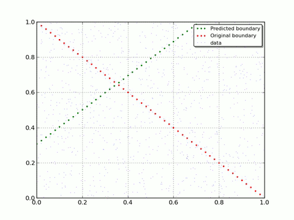

Simplest example
================

* `Data`_
* `Neural Network`_
* `How it performs`_

I'll try do describe how to use TNNF to solve a simplest artificial task I was able to design.

Let's create a simple classifier that will assign 0 or 1 class to data from input. And as we don't want random classification, let's try to train our classifier on previously manually labeled data.

Data
----

Let's imagine we have some amount of manually labeled data (to label data we will use particular "decision rule"). This data will be used to train our classifier.

In this particular task I assume we have to classify a pair of numbers :math:`(X_1, X_2)`, where :math:`X_1, X_2 \in [0, 1)`
and assign each pair 0 or 1 class. To manually label this data let's use such formula:

.. math::

  Label = \begin{cases}
              0 & \text{if: } -X_1 + 1 < X_2\\
              1 & \text{if: } -X_1 + 1 \geq X_2
          \end{cases}

Here is how our labeled data looks on 2D plot:

.. image:: ../media/HOWTOs/data_visualisation.png
   :alt: Labeled raw data

Neural Network
--------------

As was mentioned - let's use TNNF to solve this task.

What we have:

* Randomly generated data for training
* Randomly generated data for cross-validation
* Labels

What we want to achieve:

* Given generated data - using TNNF - predict correct labels

To do this, we will use one-layer Neural Network with simplest Linear activation function and architecture:

* Input layer: 2 neurons
* Output layer: 1 neuron

To define **predicted** label we will round the activation of output layer:

.. math::

   Output = \begin{cases}
              0 & activation \leq 0.5\\
              1 & activation > 0.5
           \end{cases}

Here is how it looks in code.

Set general options for whole network, such as:

* Learning step
* Size of mini-batch we will use (in this case we use full batch)
* Size of cross-validation set

.. literalinclude:: src/HOWTOs/SimplestExample.py
   :language: python
   :start-after: #NN part
   :end-before: #Layer architecture

Describe per layer architcture. Set:

* Number of neurons on layer's input
* Number of neurons on layer's output
* Specify activation function to use

.. literalinclude:: src/HOWTOs/SimplestExample.py
   :language: python
   :start-after: CV_size=dataSize
   :end-before: #Compile NN

Put everything together and create network object:

.. literalinclude:: src/HOWTOs/SimplestExample.py
   :language: python
   :start-after: FunctionModel.Linear
   :end-before: #Compile NN train

How it performs
---------------

Instead of talking how well it performs its better to show this.
To visualise predicted boundary we will use network's weights and bias that it learned during training.

As we use Linear activation function, we can write a formula to calc output activation:

.. math::

   activation = w_1X_1 + w_2X_2 + b

Using our previous formula to define predicted label, we can rewrite this as follows:

.. math::

   w_1X_1 + w_2X_2 + b \gtreqless 0.5

To be able to draw predicted decision boundary we need to express :math:`X_2` :

.. math::

   X_2 \gtreqless -\frac{w_1}{w_2}X_1 + \frac{0.5 - b}{w_2}

Here is how it looks like in code:

.. literalinclude:: src/HOWTOs/SimplestExample.py
   :language: python
   :start-after: w2 = NN.varWeights[0]['w']
   :end-before: #Limit our plot by axes

If you enable drawing and set reasonable *drawEveryStep* you will get number of pictures that shows how Neural Net evolves.
To get rid you from routine we already did this with small *drawEveryStep* and prepare a gif to show a progress:

As you can see - with each iteration Neural Net moves closer to original decision boundary.
That is what we wanted to show you: how simple Neural Network adapt and learn on real data.

Full `script <https://raw.githubusercontent.com/spaceuniverse/TNNF/master/doc/src/HOWTOs/SimplestExample.py>`_ listing:

.. include:: src/HOWTOs/SimplestExample.py
   :code: python

