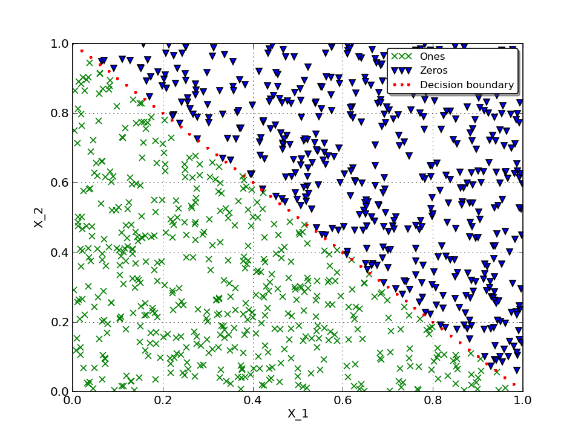

Simplest example
================

I'll try do describe how to use TNNF to solve a simplest artificial task I was able to design.

Let's create a simple calssifier that will assign 0 or 1 class to data from input. And as we don't want random classification, let's try to train our classifier on previously manually labeled data.

Data
----

Let's imagine we have some amount of manually labeled data (to label data we will use particular "decision rule"). This data will be used to train our classifier.

In this particular task I assume we have to classify a pair of numbers :math:`(X_1, X_2)`, where :math:`X_1, X_2 \in [0, 1)`
and assign each pair 0 or 1 class. To manually label this data let's use such formula:

.. math::

  Label = \begin{cases}
              0 & \text{if: } -X_1 + 1 < X_2\\
              1 & \text{if: } -X_1 + 1 \geq X_2
          \end{cases}

Here is how our labeled data looks on 2D plot:

Neural Network
--------------

As was mentioned - let's use TNNF to solve this task.

What we have:

* Randomly generated data for training
* Randomly generated data for cross-validation
* Labels

What we want to achieve:

* Given generated data - using TNNF - predict correct labels

To do this, we will use one-layer Neural Network with simplest Linear activation function and architecture:

* Input layer: 2 neurons
* Output layer: 1 neuron

To define **predicted** label we will round the activation of output layer:

.. math::

   Output = \begin{cases}
              0 & activation \leq 0.5\\
              1 & activation > 0.5
           \end{cases}

Here is how it looks in code.

Set general options for whole network, such as:

* Learning step
* Size of mini-batch we will use (in this case we use full batch)
* Size of cross-validation set

.. literalinclude:: src/HOWTOs/SimplestExample.py
   :language: python
   :start-after: #NN part
   :end-before: #Layer architecture

Describe per layer architcture. Set:

* Number of neurons on layer's input
* Number of neurons on layer's output
* Specify activation function to use

.. literalinclude:: src/HOWTOs/SimplestExample.py
   :language: python
   :start-after: CV_size=dataSize
   :end-before: #Compile NN

Put everything together and create network object:

.. literalinclude:: src/HOWTOs/SimplestExample.py
   :language: python
   :start-after: FunctionModel.Linear
   :end-before: #Compile NN train

.. include:: src/HOWTOs/SimplestExample.py
   :code: python

